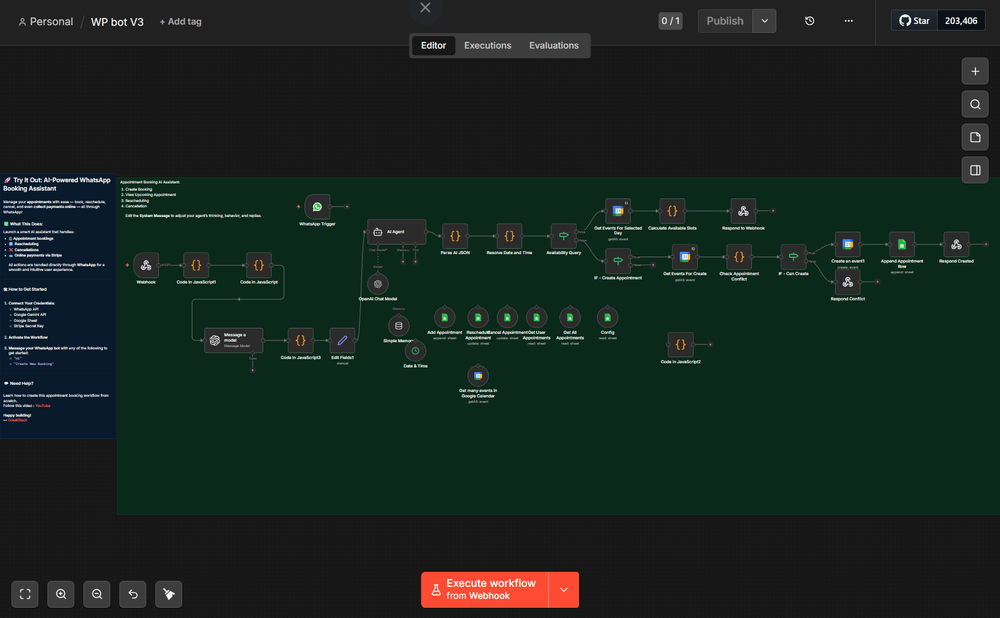

# 💬 AI Destekli WhatsApp Randevu Asistanı (n8n + OpenAI + Google Calendar)

Bu proje, müşterilerin WhatsApp üzerinden kuaför, berber veya benzeri işletmelere **doğal dilde mesaj yazarak randevu almasını, değiştirmesini ve iptal etmesini** sağlayan uçtan uca bir otomasyondur. Sistem, yapay zeka ile mesajı anlar, Google Takvim'deki müsaitlik durumunu kontrol eder, çakışma varsa kullanıcıya bildirir ve randevuyu oluşturur.

## 🧠 Nasıl Çalışır? (Mimari Akış)

1. **WhatsApp Trigger:** Müşteri WhatsApp üzerinden "Yarın 14:00'te saç kesimi istiyorum" gibi bir mesaj gönderir.
2. **Mesaj Normalizasyonu:** Gelen mesaj temizlenir ve işlem tipi (Oluşturma, İptal, Sorgulama vb.) belirlenir.
3. **AI Agent:** OpenAI modeli (gpt-4.1-mini), mesajı analiz eder ve isim, tarih, saat, hizmet gibi bilgileri JSON formatında çıkarır.
4. **Tarih/Saat Çözümleme:** "Yarın", "Cuma" gibi göreceli ifadeler gerçek tarih ve ISO formatına çevrilir.
5. **Takvim Çakışma Kontrolü:** Google Takvim'de ilgili zaman aralığı kontrol edilir. Eğer doluysa kullanıcıya uygun alternatifler gösterilir.
6. **Randevu Oluşturma:** Uygun saat bulunduğunda Google Takvim'e etkinlik eklenir.
7. **Veritabanı Kaydı:** Randevu bilgileri Google Sheets'e (müşteri veritabanı) kaydedilir.
8. **Yanıt Gönderme:** Müşteriye randevunun onaylandığına dair WhatsApp üzerinden bilgi verilir.

## 🛠️ Kullanılan Teknolojiler
- **n8n** (Workflow Automation)
- **WhatsApp Business API** (Mesajlaşma)
- **OpenAI GPT-4.1-mini** (Doğal Dil İşleme)
- **Google Calendar API** (Takvim Yönetimi)
- **Google Sheets API** (Müşteri Veritabanı)

## ⚙️ Kurulum
1. `workflow.json` dosyasını n8n'e `Import from File` ile içe aktarın.
2. Tüm Credential (Kimlik Bilgisi) alanlarını kendi hesaplarınızla değiştirin:
   - **WhatsApp Business API**
   - **OpenAI**
   - **Google Calendar**
   - **Google Sheets**
3. Kullanmak istediğiniz takvimin ve veritabanı tablosunun ID'lerini güncelleyin.

## 🔒 Güvenlik ve Gizlilik
Bu depo **sadece iş akışı mimarisini** içerir. Tüm API anahtarları ve kimlik bilgileri dosyadan temizlenmiş, yerine `YOUR_...` ibareleri konulmuştur. Müşteri verileri ve kişisel bilgiler dosyada yer almaz.

## 📷 Görünüm

## 🎓 Yapımcı
Bu proje, n8n ve yapay zeka otomasyonları konusunda kendi kendini geliştiren bir geliştirici tarafından kişisel öğrenme ve pratik amacıyla tasarlanmıştır.